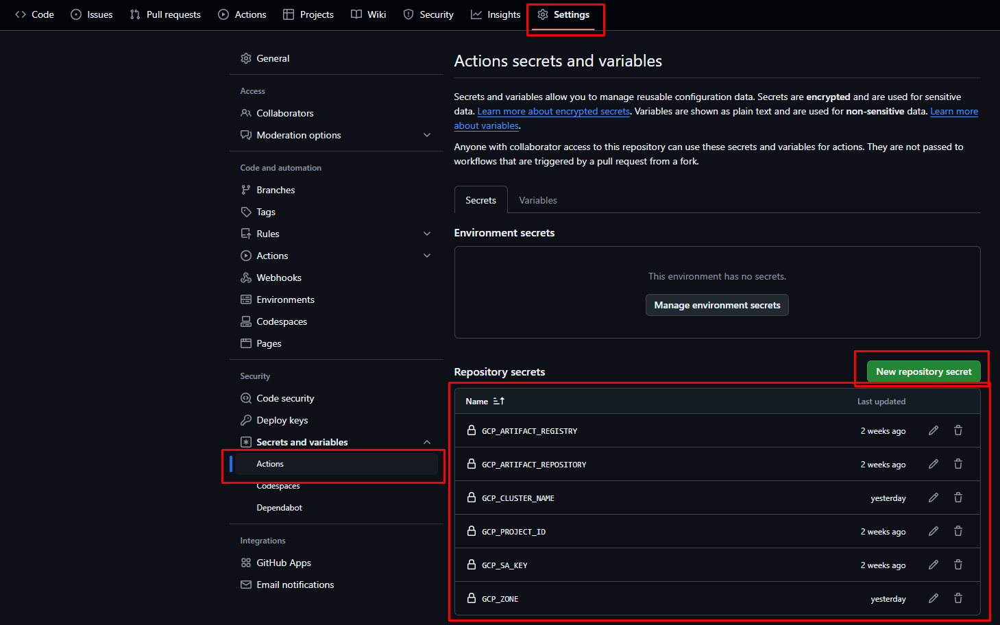
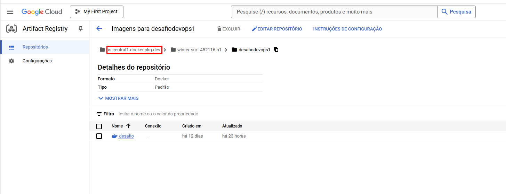
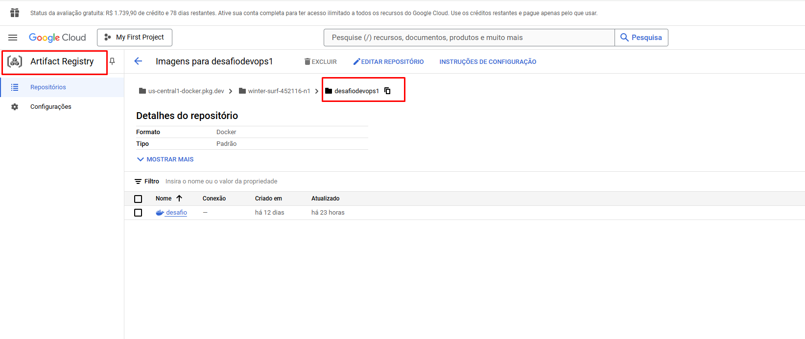
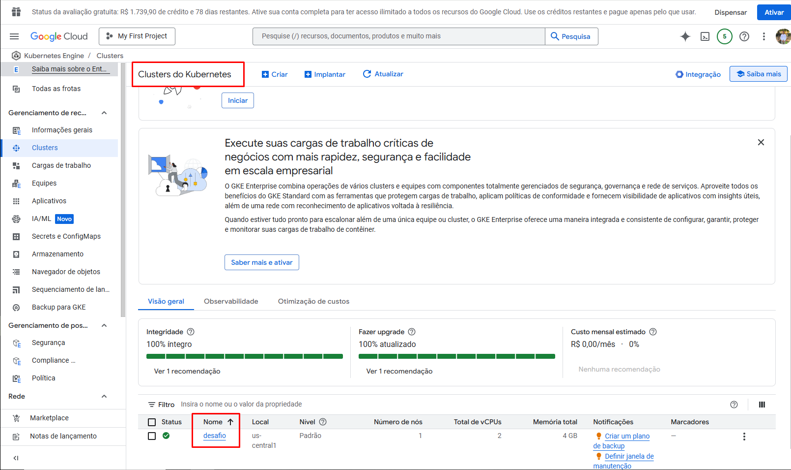
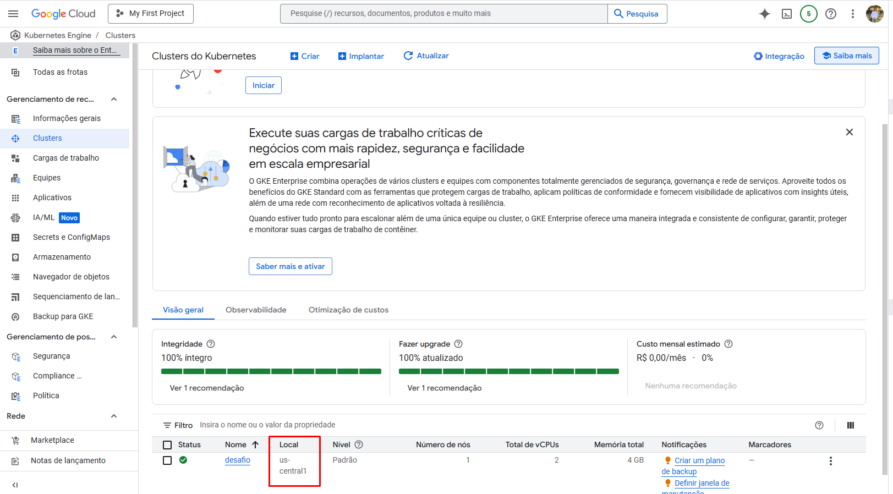
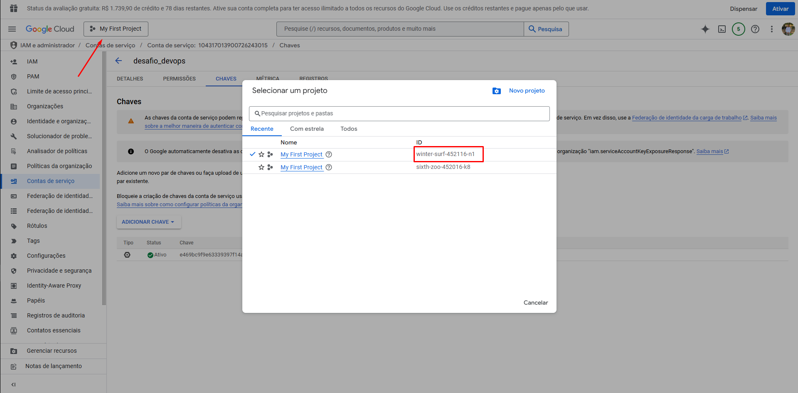

# 📌 Documentação DevOps

## 📖 Tabela de Conteúdos
1. [Criação DockerFile](#1-criação-dockerfile)
2. [Secrets GitHub](#2-secrets-github)
3. [IAM](#3-iam)
4. [Artifact Registry e Artifact Repository](#4-artifact-registry-e-artifact-repository)
5. [Nome do Cluster e Zona](#5-nome-do-cluster-e-zona)
6. [Kubernetes (K8S)](#6-kubernetes-k8s)

---

## 1. 🚀 Criação DockerFile
Um Dockerfile é um arquivo de texto que contém um conjunto de instruções para construir uma imagem Docker. Ele define o ambiente necessário para que uma aplicação seja executada, incluindo o sistema operacional base, dependências, configurações, variáveis de ambiente e comandos a serem executados.

### 🔑 Principais Instruções do Dockerfile:
- **FROM:** Define a imagem base.
- **WORKDIR:** Define o diretório de trabalho dentro do contêiner.
- **COPY:** Copia arquivos do host para o contêiner.
- **RUN:** Executa comandos durante a construção da imagem.
- **EXPOSE:** Expõe uma porta do contêiner.
- **CMD:** Define o comando padrão a ser executado quando o contêiner iniciar.

---

## 2. 🔒 Secrets GitHub
O uso de secrets no GitHub é fundamental para manter credenciais, tokens de API, chaves de acesso e outras informações sensíveis protegidas.

> ⚠️ As credenciais precisam estar cadastradas dentro do projeto do GitHub.

---

## 3. 🔑 IAM
Dentro da Google Cloud:
- Navegue até **IAM > Contas de Serviço > Criar conta de serviço**.
- Crie a chave de acesso dentro da conta de serviço e baixe o arquivo JSON.
- Cole o conteúdo na seção **Secrets and Variables (GCP_SA_KEY)**.

---

## 4. 📦 Artifact Registry e Artifact Repository
O Artifact Registry é um serviço do Google Cloud projetado para armazenar, gerenciar e distribuir artefatos de software, como imagens de contêiner, pacotes de linguagem e outros binários.

### 📌 Como criar um Artifact Registry:
1. Acesse a aba do AR.
2. Clique em **Criar Repositório > Definir Nome > Região > Criar**.

---

## 5. 🌐 Nome do Cluster e Zona
O nome do cluster e a zona são parâmetros essenciais ao criar e gerenciar um cluster no Google Kubernetes Engine (GKE) ou em outros serviços do Google Cloud.

### 📌 Como criar um Cluster:
1. Acesse a aba **Kubernetes Engine > Clusters > Criar > Modo padrão**.
2. Escolha por **Zona ou Região > Criar**.

---

## 6. 🐳 Kubernetes (K8S)
Kubernetes (K8s) é uma plataforma de orquestração de containers que automatiza a implantação, escalabilidade e operação de aplicações em contêineres.

### 📌 Componentes utilizados:
- **Deployment:** Define como um conjunto de pods deve ser gerenciado, permitindo controle sobre criação, atualização e escalabilidade.
- **Service:** Expõe os pods dentro do cluster ou para o mundo externo, permitindo comunicação entre eles.
